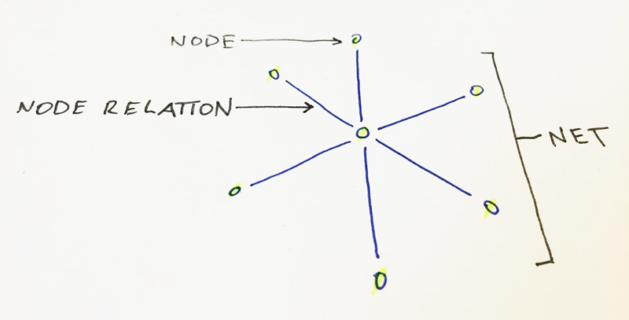

# net

**net** is a simplified relationial database visualizer. It has been inspired by my need to visualize how particular individuals relate to other individuals. The general concept builds on three necessities:

1. **Node**: an entity. Nodes can relate to other nodes.
2. **Node Relation**: the specific relationship between two nodes.
3. **Net**: a complete, interconnected network of nodes

**Is this thing on?** Nope. This is completely an idea right now. I haven't written a lick of nothing.
